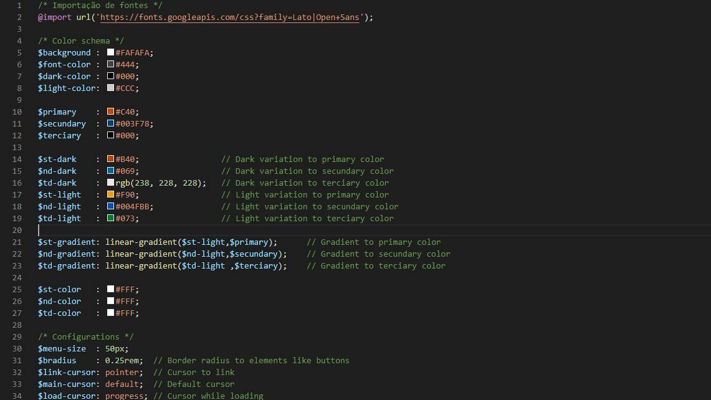

# KAS-Sass

Foto 1 - Nossa logo e slogan.

To see this file in english, access [README.md](README.md)

## Nosso objetivo
KAS-Sass é um framework web brasileiro para desenvolvimento front-end cujo objetivo é agilizar a produção de layouts e estilos CSS mas sem "engessar" o desenvolvedor a um estilo único, dando a ele liberdade para modificar de forma rápida suas características, tudo isso através do nosso arquivo de configuração.

## Tecnologias utilizadas
KAS-Sass é inteiro desenvolvido utilizando a sintaxe SCSS do pré-processador de estilos [Sass](https://sass-lang.com/), portanto, para utilizá-lo é preciso ter este instalado em sua máquina.
Estou também adaptando o código para a metodologia de desenvolvimento [Atomic Design](https://atomicdesign.bradfrost.com).

### Instalando o Sass
Para ver todas as formas de instalar o Sass, você pode [acessar a página oficial do projeto](https://sass-lang.com/install), mas, de forma resumida...
Para instalar o Sass utilizando o [Node.js](https://nodejs.org/pt-br/) basta abrir o terminal de comandos e digitar <b>npm i -g sass</b> e esperar que o download seja concluido.

## Como usar?
Usar o KAS-Sass é simples: basta...
* Baixar o código fonte presente [na pasta 'src' deste projeto](https://github.com/AlarmedEwe/KAS-Sass/src)
* Editar o arquivo <i>KAS-config.scss</i> de acordo com suas preferências (isso se desejar, claro)
* Compilar o arquivo usando o [Sass](https://sass-lang.com/guide) (recomendamos usar o comando <b>sass --watch input.scss output.css</b>)
* Incorporar o arquivo CSS gerado no seu código (se for HTML, basta usar a tag <b>&lt;link rel="stylesheet" href="output.css" /&gt;</b>)

### KAS-config.scss

Foto 2 - Arquivo de configurações do KAS-Sass

Esse é o arquivo de configurações do KAS-Sass. Através dele você pode aterar todo o esquema de cores primárias e secundárias do seu site, bem como o tamanho mínimo para que o menu não se torne um menu hamburguer ou o tamanho da propriedade <i>border-radius</i> de elementos como botões.